# Модель электронного гида

# Описание

**Электронный гид** — консольное приложение для работы с достопримечательностями: выбор на карте, просмотр информации и фотографий, создание маршрутов и публикация отзывов.

Система использует локальное хранение в JSON-файле и взаимодействует с пользователем через меню (CLI интерфейс).

# Сущности

- *Электронный гид* - центр предметной области, хранит сущности и реализует операции
- *Достопримечательность* - описание места, клетка на карте, теги, список фотографий
- *Маршрут* - набор достопримечательностей + статус (черновик/опубликован/архив)
- *Карта* - сетка клеток (например A1, B2), отображается в консоли.
- *Фотография* - название и путь к файлу фото
- *Отзыв* - отзыв пользователя (автор, оценка, текст, дата).

# Возможности системы

1. Выбор достопримечательности на карте: ввод клетки (например `B2`) → получение id
2. Получение информации о достопримечательности: вывод названия, описания, тегов, клетки
3. Создание маршрута: создаётся маршрут в статусе «черновик»
4. Просмотр фотографий: список фотографий, связанных с достопримечательностью
5. Публикация отзыва: ввод автора, оценки и текста → отзыв сохраняется.

# Архитектура и модули

- `domain/` — сущности предметной области 
- `domain/guide.py` — электронный гид (Guide)
- `persistence/` — работа с хранением (JsonStorage)
- `services/` — вспомогательные сервисы (генерация id)
- `tests/` — unit-тесты
- `photos/` — исходные фото достопримечательностей

# Хранение данных

Данные хранятся в `data/storage.json`. Файл хранит один JSON-объект с массивами сущностей: dostoprimechatelnosti, marshruty, fotografii, otzyvy. 
При первом запуске вызывается seed_if_empty(), которая добавляет стартовые записи. Пользователь не может добавить новые достопримечательности и их описания. Он работает только с операциями гида.

# Класс Attraction
Экземпляр хранит данные о конкретном месте (название, описание), его положение на карте в виде клетки (`cell_id`), а также связанные теги и фотографии.
Нужен для представления достопримечательность в системе электронного гида,гарантии корректность ключевых полей (валидация выполняется при создании объекта), хранения связи с фотографиями через список идентификаторов `photo_ids`.

## Поля
- `id: EntityId` - уникальный идентификатор достопримечательности.
- `name: str`- название
- `description: str` - описание
- `cell_id: str` - клетка на карте (например `A1`), нормализуется к верхнему регистру.
- `tags: list[str]` - список тегов 
- `photo_ids: list[EntityId]` — список идентификаторов фотографий (если не передан - пустой).

## Валидация в конструкторе
- Пустое `name` → `ValidationError("Название не может быть пустым")`.
- Пустое `description` → `ValidationError("Описание не может быть пустым")`.
- Некорректный `cell_id` → ошибка в `_validate_cell_id` (например, если нет буквы/числа или столбец ≤ 0).

## Методы
- `add_photo(photo: Photo) -> None` — добавляет `photo.id` в `photo_ids`, если его там ещё нет.
- `_validate_cell_id(value: str) -> str` — приводит клетку к виду `A1`/`B2` и проверяет:
  - первый символ — буква `A..Z`,
  - остальная часть — число,
  - число > 0.

# Класс EntityId
`EntityId` - объект-обёртка над строковым идентификатором сущности. Нужен, чтобы централизованно валидировать id и корректно сравнивать и использовать их в коллекциях.

## Поля
- `_value: str` - значение идентификатора.

## Методы
Содержит основные методы для вывода, возврата значения ID, сравнения.

# Класс Guide
Гид управляет коллекциями сущностей (достопримечательности, фото, маршруты, отзывы), предоставляет операции для меню и умеет экспортировать/импортировать состояние в структуру `dict` для JSON-хранилища.

## Поля
- `map_view: MapView` — отвечает за нормализацию клетки и карты.
- `ids: IdGenerator` — генерирует `routeYYYYMMDD`, `reviewYYYYMMDD`.
- `_attractions: dict[str, Attraction]` — ключ: `EntityId.value`.
- `_routes: dict[str, Route]` — ключ: `EntityId.value`.
- `_photos: dict[str, Photo]` — ключ: `EntityId.value`.
- `_reviews: dict[str, Review]` — ключ: `EntityId.value`.

## Методы
*Карта, выбор по карте*
- `map_text() -> str` — собирает занятые клетки (`cell_id -> attraction.id.value`) и отдаёт текст карты через `MapView.render(...)`.
- `select_attraction_on_map(cell_id: str) -> EntityId` — нормализует ввод `MapView.normalize_cell_id(...)`, ищет достопримечательность в этой клетке; если нет - ошибка.

*Достопримечательности и фото*
- `list_attractions()` — возвращает все достопримечательности.
- `get_attraction(attraction_id: EntityId)` — ищет по id, иначе ошибка.
- `attraction_info(attraction_id: EntityId) -> str` — формирует текстовую карточку (название, описание, клетка, теги).
- `add_photo(photo: Photo)` / `get_photo(photo_id: EntityId) ` — добавление и получение фото.
- `list_photos_for_attraction(attraction_id: EntityId) -> list[Photo]` — по `photo_ids` достопримечательности возвращает объекты `Photo`.

*Маршруты*
- `list_routes()`, `get_route(route_id: EntityId)` — доступ к маршрутам.
- `create_route(name: str) -> EntityId` — создаёт маршрут в статусе `DRAFT`, генерирует id через IdGenerator и делает его уникальным.

*Отзывы*
- `publish_review(attraction_id, author, rating, text) -> EntityId` — создаёт отзыв, генерирует уникальный id.
- `list_reviews_for_attraction(attraction_id: EntityId) -> list[Review]` — фильтрует отзывы по `attraction_id`.

*Заполнение данных*
- `seed_if_empty() -> None` — если достопримечательности уже есть, ничего не делает; иначе создаёт 3 достопримечательности и 3 фото.
- При обнаружении совпадающих id у достопримечательностей выбрасывает `DuplicateError`.

*Работа с JSON (импорт и экспорт состояния)*
- `export_state() -> dict` — преобразует все коллекции в списки словарей:`"dostoprimechatelnosti"`, `"marshruty"`, `"fotografii"`, `"otzyvy"`.
- `import_state(data: dict) -> None` — очищает текущие коллекции через `.clear()` и пересоздаёт сущности из словарей.
- Вспомогательные методы сериализации:
  - `_attraction_to_dict` / `_attraction_from_dict`
  - `_photo_to_dict` / `_photo_from_dict`
  - `_route_to_dict` / `_route_from_dict` (парсит статус через `_parse_route_status`)
  - `_review_to_dict` / `_review_from_dict`
- `_parse_route_status(value: str) -> RouteStatus` — ищет статус по `RouteStatus.value`, иначе ошибка

# Класс MapView
Отображение карты в консоли. Формирует текстовую сетку с координатами (например `A1`, `B2`) и отмечает занятые клетки символом `X`.

## Поля
- `rows: list[str]` — список буквенных строк карты (например `["A", "B", "C"]`), нормализуется к верхнему регистру.
- `cols: int` — количество столбцов (нумерация с 1).
- `_cell_w: int` — ширина “ячейки” при выводе (используется для выравнивания).

## Методы
- `render(occupied_cells: dict[str, str]) -> str`  
  Возвращает строку-карту. Если клетка присутствует в `occupied_cells`, выводится `X`, иначе `.`  
  В конце добавляется легенда: `X — достопримечательность,. — пусто`.
- `normalize_cell_id(cell_id: str) -> str`  
  Приводит введённую пользователем клетку к нормализованному виду (`strip()` + `upper()`).  
  Если длина < 2 → `ValidationError("Введите клетку карты(A1)")`.

# Класс Photo
Сущность “фотография” в электронном гиде. Хранит идентификатор, название и путь к файлу изображения.

## Поля
- `id: EntityId` — уникальный идентификатор фотографии.
- `title: str` — название/подпись фотографии.
- `file_path: str` — путь к файлу изображения (например `photos/station.jpg`).

# Класс Review
Отзыв о достопримечательности. Хранит автора, оценку, текст и дату создания, а также связывается с конкретной достопримечательностью через `attraction_id`.

## Поля
- `id: EntityId` — уникальный идентификатор отзыва.
- `attraction_id: EntityId` — идентификатор достопримечательности, к которой относится отзыв.
- `author: str` — автор отзыва; если после `strip()` пусто, подставляется `"Аноним"`.
- `rating: int` — оценка, должна быть в диапазоне 1–5.
- `text: str` — текст отзыва.
- `created_at_iso: str` — строка даты/времени создания в ISO-формате, не может быть пустой.

# Класс RouteStatus
Описывает состояние маршрута в системе. Используется для явного хранения и проверки “жизненного цикла” маршрута (создан → опубликован → архив) и для вывода статуса.

## Поля
- `DRAFT = "черновик"` 
- `PUBLISHED = "опубликован"` 
- `ARCHIVED = "архив"` 

# Класс Route
Сущность “маршрут”, содержащая имя, текущий статус и упорядоченный список остановок. Поведение класса: изменять список остановок можно только в статусе `DRAFT`

## Поля
- `id: EntityId` — уникальный идентификатор маршрута.
- `name: str` — название маршрута .
- `status: RouteStatus` — статус маршрута (по умолчанию `RouteStatus.DRAFT`).
- `attraction_ids: list[EntityId]` — список остановок маршрута по порядку.

## Методы
Изменение остановок
- `add_stop(attraction_id: EntityId) -> None`  
  Разрешён только в `DRAFT`, иначе ошибка.  Добавляет `attraction_id`, если его ещё нет в `attraction_ids`.
- `remove_stop(attraction_id: EntityId) -> None`  
  Разрешён только в `DRAFT`, иначе ошибка.  Удаляет `attraction_id`, если он присутствует в `attraction_ids`.
- `publish() -> None`  
  Запрещён из `ARCHIVED`. Если уже `PUBLISHED`, ничего не делает. Если остановок нет (`attraction_ids` пуст), запрещает публикацию. Иначе переводит в `RouteStatus.PUBLISHED`.
- `archive() -> None`  
  Если уже `ARCHIVED`, ничего не делает, иначе переводит в `RouteStatus.ARCHIVED`.
- `unpublish_to_draft() -> None`  
  Разрешён только из `PUBLISHED`, иначе ошибка. Переводит статус в `RouteStatus.DRAFT`.

# Класс JsonStorage
Слой хранения данных приложения в JSON-файле. Умеет загружать данные из файла в словарь и сохранять обратно, оборачивая ошибки ввода/вывода и ошибки JSON-парсинга в доменные исключения.

## Поля
- `_file_path: str` — путь к JSON-файлу хранилища.

## Методы
- `load() -> dict` - Читает файл `_file_path` и возвращает данные как словарь. Если файл не найден → возвращает “пустое хранилище”: `{"dostoprimechatelnosti": [], "marshruty": [], "fotografii": [], "otzyvy": []}`. Если существует пустой файл, возвращает то же “пустое хранилище”. Иначе парсит содержимое через `json.loads()`.Если распарсилось не в `dict`, то `StorageLoadError("Файл хранения должен содержать JSON-объект.")`. Если произошла ошибка чтения или ошибка парсинга, то выбрасывваем ошибку чтения JSON.
- `save(data: dict) -> None`- Записывает `data` в файл `_file_path` в формате JSON. Использует `json.dump(..., ensure_ascii=False, indent=2)`, чтобы кириллица и другие non-ASCII символы сохранялись без `\uXXXX` и файл был читабельным. При ошибке записи выбрасывает `StorageSaveError`.

# Класс IdGenerator
Генератор ID в формате `префиксYYYYMMDD`

## Метод `new_id(prefix: str) -> str`
Берёт очищенный префикс.Если он пустой, использует значение по умолчанию `"id"`. Возвращает строку: `"{clean_prefix}{YYYYMMDD}"`, где дата — сегодняшняя в формате `YYYYMMDD`.
## Работа с программой
На вход - консольное меню.
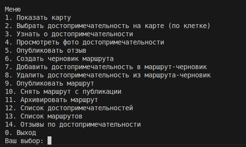
1. - показ карты.
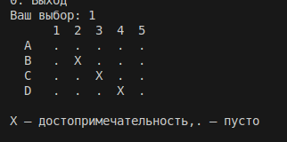
2. - выбор достопримечательности, показ ее айди. Пользователь вводит клетку. Если неправильно, то программа выдает ошибку.
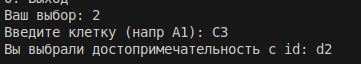
или
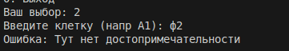
3. - показ информации о достопримечательности
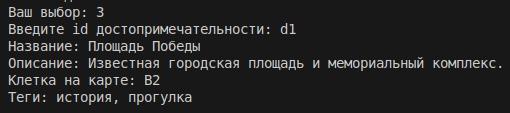
или

4. - просмотр фото
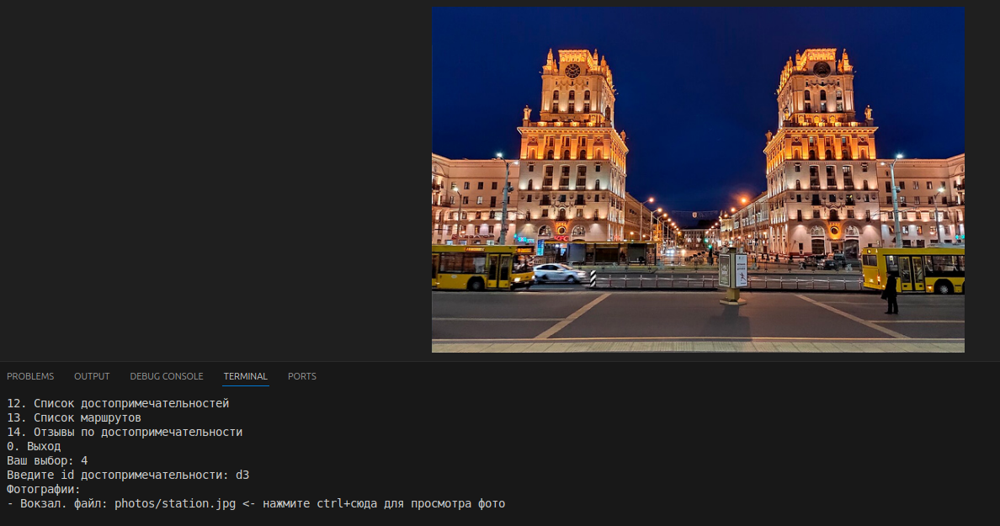
или

5. - публикация отзыва

6. - создать черновик маршрута

7. - добавить остановку
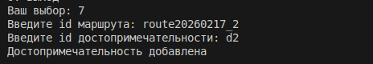
8. - удаление остановки
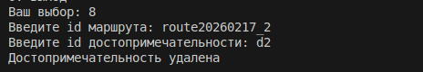
9. - публикация маршрута
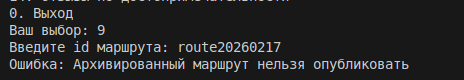
или
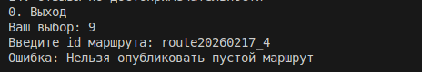
или
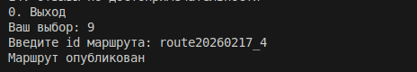
10. - маршрут из публикации в черновик
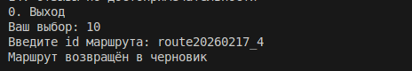
11. - архивировать маршрут
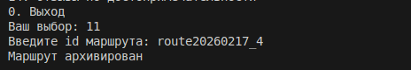
12. - список достопримечательностей

13. - список маршрутов
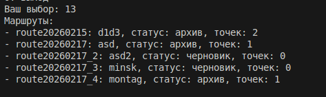
14. - отзывы на достопримечательность
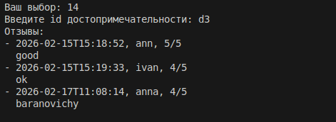
0. - выход

