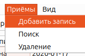
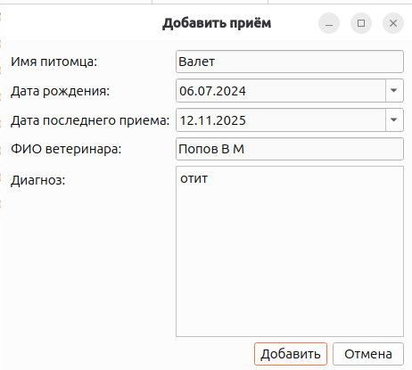

# Отчет по разработанной системе

## 1. Назначение системы
Приложение предназначено для ведения массива записей о ветеринарных приемах с хранением данных в SQLite базе данных и обменом данными через XML.

Структура записи:
- Имя питомца
- Дата рождения
- Дата последнего приема
- ФИО ветеринара
- Диагноз

## 2. Архитектура (MVC)
Проект реализован по шаблону Model-View-Controller:
- Model:
  - `models/database.py` — работа с SQLite (CRUD, переключение БД).
  - `models/vet_record.py` — структура данных записи и критериев.
  - `models/xml_storage.py` — XML: запись через DOM, чтение через SAX.
  - `models/proxy_model.py` — фильтрация и пагинация.
- View:
  - `views/main_window.py` — главное окно, меню, toolbar, таблица/дерево, панель пагинации.
  - `views/add_dialog.py` — диалог добавления.
  - `views/search_dialog.py` — диалог поиска + таблица результатов + пагинация.
  - `views/delete_dialog.py` — диалог удаления.
- Controller:
  - `controllers/main_controller.py` — связывает действия UI и модели, управляет обновлением представлений.

## 3. Реализованные функции
- Главное окно + дочерние диалоги, вызов через меню.
- Команды меню продублированы на панели инструментов.
- Добавление записей через отдельный диалог.
- Поиск по отдельному диалогу с выводом результатов в этом же диалоге.
- Удаление через отдельный диалог с сообщением о количестве удаленных записей.
- Отображение текущего массива записей в главном окне.
- Хранение записей в базе данных SQLite.
- Альтернативное отображение массива в виде дерева.
- Сохранение/загрузка XML через стандартные диалоги.
- Выбор/переключение файла БД через стандартный диалог.
- Типы полей: даты хранятся как `date`, для ввода дат используются `QDateEdit` с календарем.
- Пагинация в главном окне и в диалоге поиска: первая/предыдущая/следующая/последняя страница, изменение размера страницы, отображение текущей страницы и количества записей.

## 4. Условия поиска и удаления
В приложении поддерживаются строго три режима (ровно один за операцию):
1. По имени питомца и дате рождения.
2. По дате последнего приема и ФИО ветеринара.
3. По фразе из диагноза.

## 5. Демонстрационные данные
- `xml/first_base.xml` содержит ~30 записей;
- `xml/second_base.xml` содержит ~30 записей;
- `xml/fourth_base.xml` содержит ~31 запись;
- `xml/fifth_base.xml` содержит ~28 записей;
- `xml/third_base.xml` 

## 8. Сценарии демонстрации системы
1. Добавление записи:
   - Открыть `Приемы -> Добавить запись`.

   

   - Заполнить все поля.

   

   - Убедиться, что запись появилась в таблице и в режиме дерева.

2. Поиск по режиму 1:
   - Открыть `Приемы -> Поиск`.
   - Отметить `Имя питомца` и `Дата рождения`, выполнить поиск.
   - Проверить результат в таблице диалога поиска, листать страницы.

3. Поиск по режиму 2:
   - В поиске отметить `Дата последнего приема` и `Ветеринар`.
   - Выполнить поиск, проверить результат и пагинацию.

4. Поиск по режиму 3:
   - В поиске отметить только `Фраза диагноза`.
   - Выполнить поиск по подстроке диагноза.

5. Удаление:
   - Открыть `Приемы -> Удаление`.
   - Выбрать один из трех режимов условий.
   - Подтвердить удаление и проверить сообщение о количестве удаленных записей.

 

6. Переключение представления:
   - В `Вид` выбрать `Таблица`, затем `Дерево`.
   - Проверить, что дерево заполнено и соответствует текущей странице данных.

7. XML экспорт/импорт:
   - `Файл -> Сохранить XML`.
   - Затем `Файл -> Загрузить XML` и убедиться, что записи восстановились.
8. Переключение БД:
   - `Файл -> Выбрать БД`.
   - Выбрать другой файл SQLite и проверить, что отображаются данные выбранной БД.

