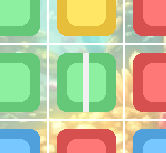
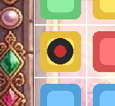
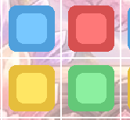
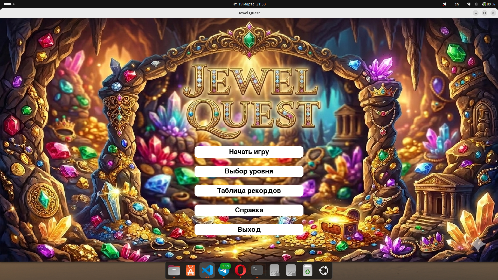
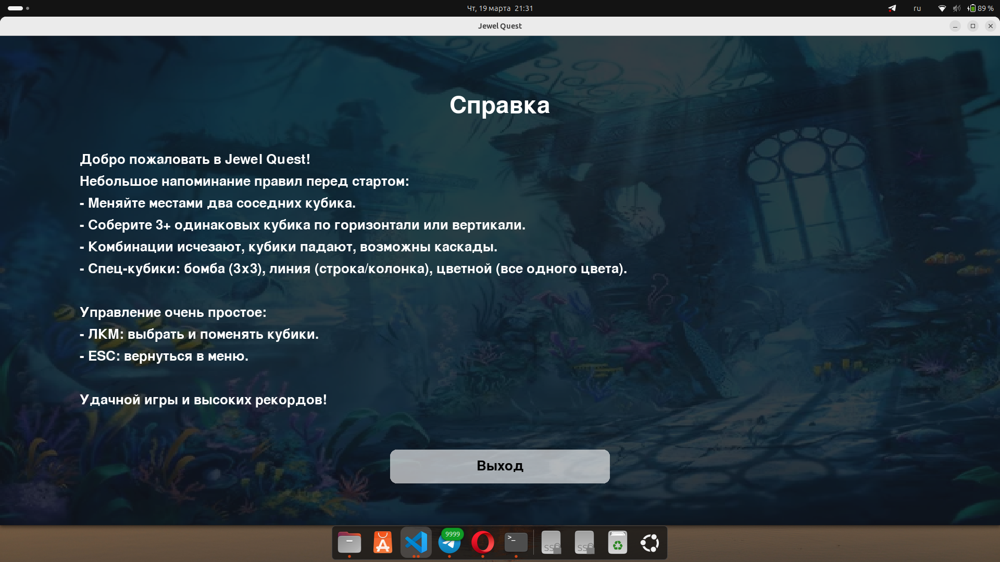
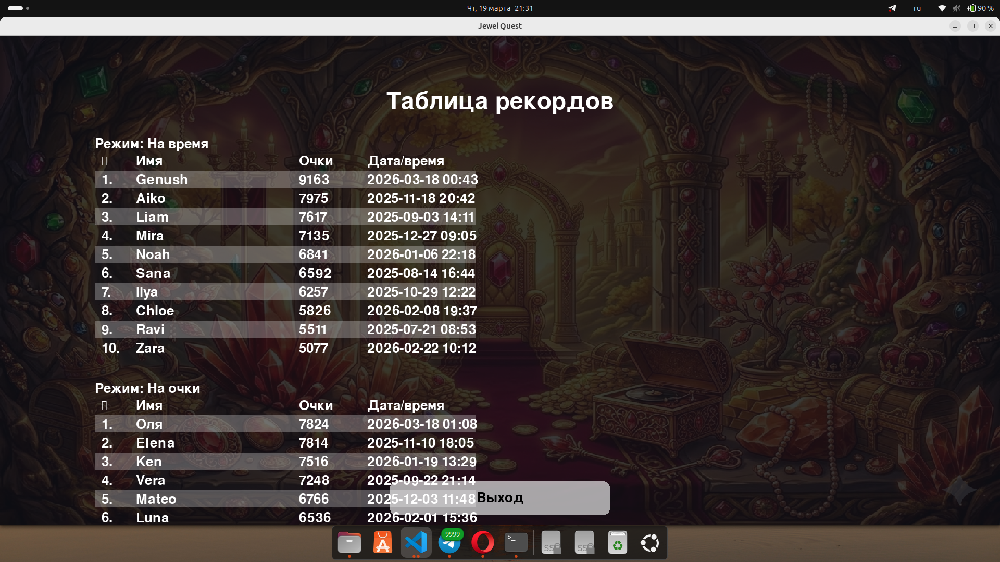
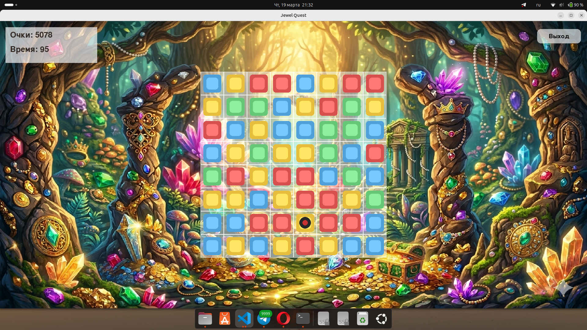
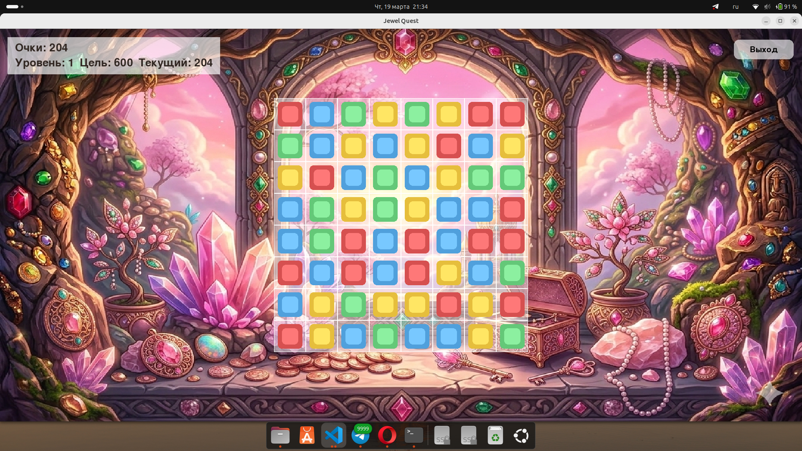
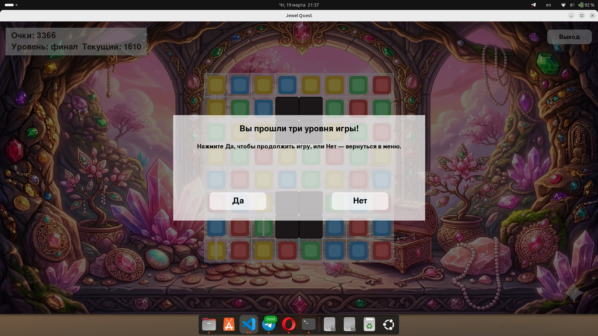
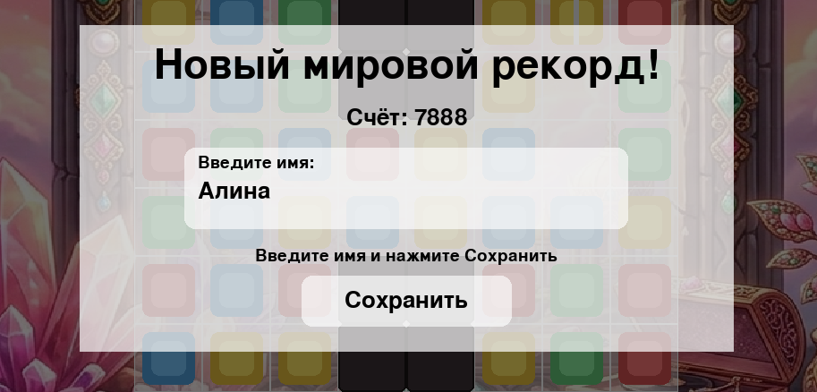

# Jewel Quest 

## Описание
Игра в жанре match-3 по мотивам Jewel Quest. Реализованы два режима:
- **На время** — набрать максимальный счет за ограниченное время.
- **На очки** — пройти минимум 3 уровня, набрав целевые очки.

Поддержаны анимации обмена, исчезновения, падения и взрыва бомб, а также спец-кубики с эффектами.

## Архитектура
Проект разделен на модули:
- `main.py` — точка входа, инициализация pygame.
- `game/game.py` — главный цикл, состояния, UI, звук.
- `game/board.py` — логика поля 8x8, поиск матчей, каскады.
- `game/jewel.py` — класс кубика.
- `game/effects.py` — эффекты спец-кубиков.
- `game/animation.py` — менеджер анимаций.
- `ui/menu.py` — главное меню и меню выбора режима.
- `ui/help_screen.py` — экран справки.
- `config_loader.py` — загрузка JSON.
- `score.py` — таблица рекордов.

## Правила игры
- Меняйте местами два соседних кубика.
- Соберите 3+ одинаковых кубика по горизонтали или вертикали.
- Комбинации исчезают, кубики падают, формируются каскады.
- Если обмен не создает комбинацию — кубики возвращаются.
- В некоторых уровнях есть заблокированные клетки, через которые кубики не проходят.

## Спец-кубики
- **Бомба** — взрыв 3x3.
- **Линия** — очищает строку или колонку.
- **Цветной** — удаляет все кубики одного цвета.

## Управление
- ЛКМ — выбрать/поменять кубики.
- ESC — выйти в меню.

## Конфигурация
Все настройки находятся в JSON:
- `data/settings.json` — окно, анимации, звук, очки, фон и палитра.
- `data/levels.json` — уровни для режима "на очки" (включая заблокированные клетки).
- `data/highscores.json` — таблица рекордов.

## Кубики
## Разбивают строку (столбец)

## Бомба (9 вокруг)

## Базовые кубики

## Тестовая работа

Меню:

Справка:

Таблица рекордов:

Режим на время:
 

Режим на очки: 

Режим на уровни:

Нет - выход в меню без сохранения прогресса.
Да - продолжение игры, пока не побьется рекорд либо с возможностью выхода в любой момент

Побитие рекорда: 

